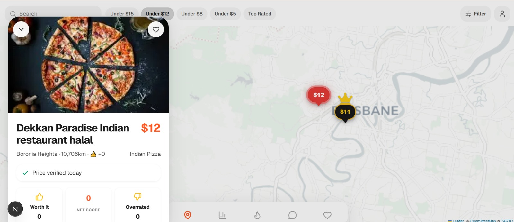

# 🍽️ FoodPin

<p align="center">
  
</p>

<p align="center">
  Discover Nearby Meals, Restaurants & Hot Deals in Real-Time
</p>

<p align="center">
  Next.js • TypeScript • Google Maps • Location Services
</p>

---

## 🚀 Overview

FoodPin is a location-based food discovery platform that connects users with nearby restaurants through an interactive map experience. Restaurant owners can create their business profiles, add meals, publish special offers, and place their locations on the city map.

Users can explore nearby restaurants, discover trending meals, view hot deals, and find food options around their live location instantly.
---
## ✨ Features

* 📍 Real-time location detection
* 🗺️ Interactive city map with restaurant pins
* 🍔 Restaurant profile management
* 🍕 Meal creation and management
* 🔥 Hot deals and promotional offers
* 🔍 Search nearby restaurants
* 📱 Fully responsive design
* ⚡ Fast and optimized user experience
* ❤️ Favorite restaurants and meals
* 🌎 Location-based food discovery

---

## 👨‍🍳 Restaurant Features

* Create restaurant profile
* Upload restaurant images
* Add and manage meals
* Publish special offers
* Update business information
* Manage menu items
* Display restaurant location on map

---

## 🍽️ User Features

* Discover nearby restaurants
* Browse meals around current location
* View restaurant information
* Explore hot deals and discounts
* Search meals by category
* View meal details and pricing
* Save favorite restaurants

---

## 🛠 Tech Stack

### Frontend

* Next.js
* React.js
* TypeScript
* Tailwind CSS

### Maps & Location

* Google Maps API
* Geolocation API

### Backend

* Node.js
* Express.js
* PostgreSQL
* Prisma ORM

### Deployment

* Vercel
* Render
* Supabase

---

## 📂 Project Structure

```text
app/
components/
public/
services/
hooks/
lib/
utils/
```

## ⚙️ Installation

Clone the repository:

```bash
git clone <repository-url>
```

Install dependencies:

```bash
npm install
```

Run development server:

```bash
npm run dev
```

Open:

```text
http://localhost:3000
```

---

## 🌟 Future Enhancements

* Online food ordering
* Real-time delivery tracking
* Restaurant reviews & ratings
* AI-powered meal recommendations
* Loyalty rewards system
* Multi-city support

---

## 👨‍💻 Developer

Faisal Ameen

Software Engineer | Full-Stack Developer

Portfolio:
https://faisalportfolio-beta.vercel.app/

LinkedIn:
https://www.linkedin.com/in/faisal-ameen07/

GitHub:
https://github.com/FaisalAmeen07

---

## 📄 License

This project is licensed under the MIT License.
